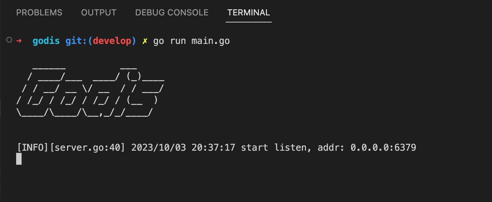

 

# Go 语言实现分布式缓存服务器

Godis 是一个用 Go 语言实现的 Redis 服务器。支持分布式和集群模式

## 项目特性
- 支持 string, hash 数据结构
- AOF 持久化
- 加载和导出 AOF 文件
- 内置集群模式
- 支持分布式

## 项目结构
- 根目录: main 函数，执行入口
- config: 配置文件解析
- interface: 一些模块间的接口定义
- lib: 各种工具，比如logger、同步和通配符
- tcp: tcp 服务器实现
- resp: redis 协议解析器
- datastruct: redis 的各类数据结构实现
    - dict: hash 表
- database: 存储引擎核心
    - standalone_database.go: 单个 database 的数据结构和功能
    - command.go: 将命令路由给响应的处理函数
    - db.go: 处理命令的核心函数
    - keys.go: del、ttl、expire 等通用命令实现
    - string.go: get、set 等字符串命令实现
    - ping.go: ping 等字符串命令实现
- cluster: 集群
  - client_pool.go: 集群入口
  - com.go: 节点间通信
  - del.go: delete 命令原子性实现
  - flush.go: flush 命令原子性实现
  - ping.go: ping 命令原子性实现
  - select.go: select 命令原子性实现
  - rename.go: rename 命令集群实现
- aof: AOF 持久化实现 